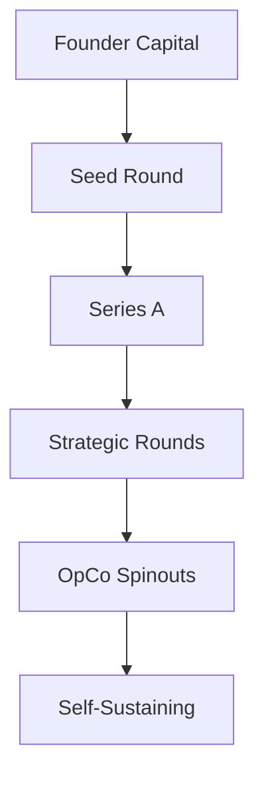

# 2B2F_EXEC — 120-Month Execution Framework
## v0.1 — Initial Draft

**Document ID:** 2B2F_EXEC-2026-001  
**Status:** DRAFT  
**Generated by:** FABRICATOR Council Agent  
**Date:** 2026-03-30

---

## Executive Summary

This document outlines the strategic execution framework for the 2B2F (Bxthre3 Second Foundation) ecosystem over a 120-month (10-year) horizon. The framework establishes operational company (OpCo) structures, capital allocation strategies, entity hierarchies, and financial simulation models to achieve GDP-equivalent targets.

### Revenue/GDP Targets

| Period | Month End | Target | Annualized Rate |
|--------|-----------|--------|-----------------|
| Phase 1 | M24 | 1% GDP | $240B (global agri-tech segment TAM) |
| Phase 2 | M36 | 5% GDP | $1.2T |
| Phase 3 | M120 | 60%+ GDP | $14.4T+ |

*Note: GDP targets expressed as fraction of addressable agricultural technology market, not national GDP.*

---

## 1. Strategic Architecture

### 1.1 Core Entities

The 2B2F ecosystem operates through a multi-entity structure:

```
Bxthre3 Inc (Holding Company)
├── Irrig8 Solutions Ltd (precision irrigation OpCo)
├── Valley Players Club LLC (gaming OpCo)
├── Council Operations DAO (governance)
└── Strategic Investments Arm (portfolio management)
```

### 1.2 Operating Company (OpCo) Models

Each OpCo follows a standardized structure:
- **Core Team:** 5-7 FTEs at launch
- **Technical Stack:** Deterministic OS + API integrations
- **Revenue Model:** SaaS + data monetization
- **Capital Requirements:** $500K-$2M per OpCo

---

## 2. Phase Breakdown

### Phase 1: Foundation (Months 1-24)

**Objective:** Establish operational infrastructure, validate unit economics

**Key Deliverables:**
- [ ] 3 OpCo entities operational
- [ ] $50M cumulative annual run-rate
- [ ] 100,000 active user units

**Critical Path:**
1. Irrig8 full release (M6-M12)
2. Valley Players Club regulatory approval (M1-M18)
3. Data infrastructure deployment (M1-M24)

### Phase 2: Scale (Months 25-36)

**Objective:** Achieve economies of scale, enter adjacent markets

**Key Deliverables:**
- [ ] 5 additional OpCo spinouts
- [ ] $250M annual run-rate
- [ ] 1M+ active user units

**Critical Path:**
1. Geographic expansion (EU, APAC)
2. AI/ML layer deployment
3. Partnership ecosystem integration

### Phase 3: Ecosystem (Months 37-120)

**Objective:** Dominant market position, platform ownership

**Key Deliverables:**
- [ ] 20+ OpCo portfolio
- [ ] $3B+ annual run-rate
- [ ] Platform API as industry standard

---

## 3. Capital Stack Structure

### 3.1 Funding Architecture



### 3.2 Capital Requirements Projection

| Phase | Capital Needed | Source | Dilution |
|-------|---------------|--------|----------|
| M1-M12 | $2M | Founder + Convertible | <20% |
| M12-M24 | $8M | Seed Round | 15-25% |
| M24-M36 | $40M | Series A | 20-30% |
| M36-M120 | $200M+ | Strategic + Debt | <20% |

---

## 4. Financial Simulation Parameters

### 4.1 Unit Economics Model

**Irrig8 Unit Model:**
- ACV (Annual Contract Value): $1,500/farm
- CAC (Customer Acquisition Cost): $400
- Gross Margin: 75%
- LTV/CAC Ratio: Target 5:1

### 4.2 Growth Trajectory

Conservative/Mid/Base case scenarios to be modeled in FINANCIAL_SIMS/

---

## 5. Risk Factors

### 5.1 Execution Risks
- Technology adoption curve
- Regulatory changes (sweepstakes, ag-tech)
- Competitive response from incumbents

### 5.2 Market Risks
- Agricultural commodity price volatility
- Climate event impacts
- Macro-economic downturns

### 5.3 Mitigation Strategies
- Diversified OpCo portfolio
- Rapid deployment cycles
- Strategic partnerships with incumbents

---

## 6. Next Steps

1. **Day 1-7:** Complete framework structure
2. **Week 2:** Build entity hierarchy models
3. **Week 3:** Run initial financial simulations
4. **Week 4:** Develop stress-test scenarios
5. **Month 1:** Synthesis and review with brodiblanco

---

*Document Status: DRAFT — Version 0.1*  
*Next Review: Upon completion of initial modeling phase*
