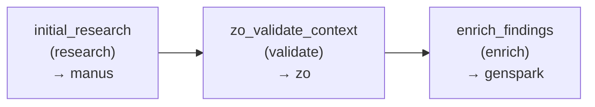

# Agentic Workflow DAG Engine
## Replaces ChatDev MacNet — Learnable Templates, Not Fixed Topologies

**Module:** `workflow_dag.py`
**Location:** `Bxthre3/projects/agentic/orchestration/workflow_dag.py`
**Status:** SPEC

---

## Purpose

ChatDev's MacNet is a **fixed DAG topology** — you design the graph, it executes it. No learning, no adaptation.

Agentic's Workflow DAG Engine is a **template-based DAG system with learned routing overrides**. The base workflow is defined per task type, but the IER Router continuously learns which agent sequences perform best and can override template defaults.

---

## Architecture

```
┌─────────────────────────────────────────────────────────────────┐
│ WORKFLOW DAG ENGINE                                               │
├─────────────────────────────────────────────────────────────────┤
│                                                                  │
│  Task arrives ──▶ Classify task type ──▶ Load DAG template       │
│                                              │                   │
│                   ┌──────────────────────────┴──────────────────┐
│                   │                                               │
│                   ▼                                               │
│              Check IER overrides ──▶ (Agent X better than template│
│                   │                              agent for this   │
│                   │                              task class?)     │
│                   ▼                                               │
│              Build execution plan ──▶ Ordered node sequence with  │
│                                       parallel execution groups    │
│                                                                  │
└─────────────────────────────────────────────────────────────────┘
```

---

## DAG Template Library

### Template Definitions

```python
@dataclass
class DAGNode:
    """Single node in a DAG — represents an agent role in the workflow."""
    id: str                           # Unique within DAG (e.g., "researcher")
    role: str                         # "research" | "write" | "review" | "validate" | "execute"
    agent_id: str | None = None       # Specific agent, or None = route to best
    depends_on: list[str] = field(default_factory=list)   # Node IDs that must complete first
    parallel: list[str] = field(default_factory=list)      # Nodes that fire simultaneously
    timeout_minutes: int = 30
    retry_policy: dict = field(default_factory=lambda: {"max_retries": 2, "backoff": "exponential"})
    min_confidence: float = 0.5       # Agent confidence threshold for this node

@dataclass
class WorkflowDAG:
    """Complete workflow definition for a task type."""
    task_type: str                    # "research" | "code" | "grant" | "deploy" | "general"
    description: str
    nodes: list[DAGNode]
    default_timeout_minutes: int = 60
    enable_parallel: bool = True       # Allow parallel execution of independent nodes
    
    # DAG metadata for IER learning
    version: str = "1.0"
    created_at: str = field(default_factory=lambda: datetime.utcnow().isoformat())
    last_modified: str = field(default_factory=lambda: datetime.utcnow().isoformat())

# Template Library
DAG_TEMPLATES: dict[str, WorkflowDAG] = {

    "research": WorkflowDAG(
        task_type="research",
        description="Multi-stage research with validation and enrichment",
        nodes=[
            # Layer 0: No dependencies — fire immediately
            DAGNode(id="initial_research", role="research", parallel=["zo_validate_context"]),
            
            # Layer 1: After initial research completes
            DAGNode(id="zo_validate_context", role="validate", depends_on=["initial_research"]),
            DAGNode(id="enrich_findings", role="enrich", depends_on=["zo_validate_context"]),
            
            # Layer 2: After enrichment
            DAGNode(id="compile_report", role="write", depends_on=["enrich_findings"]),
            DAGNode(id="final_review", role="review", depends_on=["compile_report"]),
        ],
        default_timeout_minutes=45,
    ),

    "code": WorkflowDAG(
        task_type="code",
        description="Code generation with review and test validation",
        nodes=[
            DAGNode(id="write_code", role="write", parallel=["review_plan"]),
            DAGNode(id="review_plan", role="review", parallel=["write_code"]),
            DAGNode(id="run_tests", role="validate", depends_on=["write_code"]),
            DAGNode(id="fix_issues", role="execute", depends_on=["run_tests"], parallel=["final_review"]),
            DAGNode(id="final_review", role="review", depends_on=["review_plan", "fix_issues"]),
        ],
        default_timeout_minutes=60,
    ),

    "grant": WorkflowDAG(
        task_type="grant",
        description="Grant writing with compliance validation and budget review",
        nodes=[
            DAGNode(id="initial_draft", role="write"),
            DAGNode(id="compliance_check", role="validate", depends_on=["initial_draft"]),
            DAGNode(id="budget_review", role="execute", depends_on=["initial_draft"], parallel=["compliance_check"]),
            DAGNode(id="revise_draft", role="write", depends_on=["compliance_check", "budget_review"]),
            DAGNode(id="final_compliance", role="validate", depends_on=["revise_draft"]),
        ],
        default_timeout_minutes=90,
    ),

    "deploy": WorkflowDAG(
        task_type="deploy",
        description="Deployment with health check validation",
        nodes=[
            DAGNode(id="prepare_deploy", role="execute"),
            DAGNode(id="execute_deploy", role="execute", depends_on=["prepare_deploy"]),
            DAGNode(id="health_check", role="validate", depends_on=["execute_deploy"]),
            DAGNode(id="rollback_plan", role="execute", depends_on=["health_check"]),  # Only fires if health fails
        ],
        default_timeout_minutes=30,
    ),

    "general": WorkflowDAG(
        task_type="general",
        description="Simple single-agent or linear workflow",
        nodes=[
            DAGNode(id="execute", role="execute"),
            DAGNode(id="validate", role="validate", depends_on=["execute"]),
        ],
        default_timeout_minutes=30,
    ),
}
```

---

## Core Classes

```python
from dataclasses import dataclass, field
from typing import Optional
from collections import defaultdict
import json

class ExecutionLayer:
    """A single layer of nodes that can execute in parallel."""
    layer_id: int
    nodes: list[DAGNode]
    
class ExecutionPlan:
    """Complete plan for executing a DAG — ordered layers."""
    dag: WorkflowDAG
    task_id: str
    layers: list[ExecutionLayer]
    estimated_duration_minutes: int
    
    def to_json(self) -> dict:
        return {
            "task_id": self.task_id,
            "dag_type": self.dag.task_type,
            "layers": [
                {
                    "layer_id": layer.layer_id,
                    "nodes": [n.id for n in layer.nodes]
                }
                for layer in self.layers
            ],
            "estimated_duration_minutes": self.estimated_duration_minutes
        }

class WorkflowDAGEngine:
    """
    Resolves task type to DAG template, applies IER overrides,
    and builds executable layer plan.
    """
    
    def __init__(self, templates: dict[str, WorkflowDAG] | None = None, ier_router=None):
        self.templates = templates or DAG_TEMPLATES
        self.ier_router = ier_router  # IERRouter instance for overrides
    
    def resolve(self, task: dict) -> ExecutionPlan:
        """
        Resolve task to execution plan.
        
        1. Classify task type
        2. Load DAG template
        3. Apply IER overrides (if router available)
        4. Build execution layers
        
        Args:
            task: Task dict with at least 'type' field
            
        Returns:
            ExecutionPlan with ordered layers for parallel execution
        """
        task_type = task.get("type", "general")
        dag = self._get_dag_template(task_type)
        
        # Apply IER overrides if router available
        if self.ier_router:
            dag = self.ier_router.apply_overrides(dag, task)
        
        # Build execution layers (topological sort with parallel grouping)
        layers = self._build_layers(dag, task)
        
        # Estimate duration
        estimated = self._estimate_duration(dag, layers)
        
        return ExecutionPlan(
            dag=dag,
            task_id=task.get("id", "unknown"),
            layers=layers,
            estimated_duration_minutes=estimated
        )
    
    def _get_dag_template(self, task_type: str) -> WorkflowDAG:
        """Get DAG template for task type, fallback to general."""
        return self.templates.get(task_type, self.templates["general"])
    
    def _build_layers(self, dag: WorkflowDAG, task: dict) -> list[ExecutionLayer]:
        """
        Topological sort with parallel grouping.
        
        Nodes with no dependencies go in Layer 0.
        Nodes whose dependencies are all in earlier layers go in the next layer.
        Nodes with parallel[] relationships are grouped together.
        """
        node_map = {n.id: n for n in dag.nodes}
        assigned: dict[str, int] = {}  # node_id -> layer_id
        layers: list[ExecutionLayer] = []
        
        def get_layer(node_id: str) -> int:
            if node_id in assigned:
                return assigned[node_id]
            
            node = node_map[node_id]
            
            if not node.depends_on:
                layer = 0
            else:
                max_dep_layer = max(get_layer(dep_id) for dep_id in node.depends_on)
                layer = max_dep_layer + 1
            
            assigned[node_id] = layer
            return layer
        
        # Assign all nodes to layers
        for node in dag.nodes:
            get_layer(node.id)
        
        # Group nodes by layer
        layer_groups: dict[int, list[DAGNode]] = defaultdict(list)
        for node_id, layer_id in assigned.items():
            layer_groups[layer_id].append(node_map[node_id])
        
        # Sort layers and create ExecutionLayer objects
        for layer_id in sorted(layer_groups.keys()):
            layers.append(ExecutionLayer(
                layer_id=layer_id,
                nodes=layer_groups[layer_id]
            ))
        
        return layers
    
    def _estimate_duration(self, dag: WorkflowDAG, layers: list[ExecutionLayer]) -> int:
        """Estimate total execution time based on longest path."""
        node_durations = {n.id: n.timeout_minutes for n in dag.nodes}
        max_path = 0
        
        for layer in layers:
            layer_max = max((node_durations[n.id] for n in layer.nodes), default=0)
            max_path += layer_max
        
        return min(max_path, dag.default_timeout_minutes * 2)  # Cap at 2x template default
```

---

## IER Override Integration

```python
class IEROverride:
    """Override suggestion from IER router."""
    node_id: str
    suggested_agent_id: str
    reason: str
    confidence: float  # IER confidence in this override

class IERRouter:
    """
    Part of IER module — this shows the interface used by WorkflowDAGEngine.
    """
    def apply_overrides(self, dag: WorkflowDAG, task: dict) -> WorkflowDAG:
        """
        Query IER Q-table for better agent assignments.
        
        Returns modified DAG with agent_id overrides where IER
        has high-confidence suggestions.
        """
        # Implemented in ier_router.py — this is the integration interface
        pass
```

---

## DAG Visualization

```python
def dag_to_mermaid(dag: WorkflowDAG) -> str:
    """Generate Mermaid diagram for DAG visualization."""
    lines = ["```mermaid", "graph LR"]
    
    for node in dag.nodes:
        deps = ", ".join(node.depends_on) if node.depends_on else "none"
        label = f"{node.id}<br/>({node.role})"
        if node.agent_id:
            label += f"<br/>→ {node.agent_id}"
        lines.append(f'    {node.id}["{label}"]')
    
    lines.append("")
    
    for node in dag.nodes:
        for dep in node.depends_on:
            lines.append(f"    {dep} --> {node.id}")
    
    lines.append("```")
    return "\n".join(lines)
```

Example output:


---

## Execution Engine Integration

```python
class CoherentParallelismEngine:
    """
    Executes DAG layers with parallel coordination.
    """
    
    def __init__(self, workflow_dag: WorkflowDAGEngine, reasoning_stream=None):
        self.workflow_dag = workflow_dag
        self.reasoning_stream = reasoning_stream
    
    async def execute_plan(self, plan: ExecutionPlan, task: dict) -> dict:
        """
        Execute plan layer by layer.
        
        For each layer:
        1. Fire all nodes in parallel
        2. Wait for all to complete (or timeout)
        3. Log reasoning for each node
        4. Proceed to next layer
        
        Returns:
            dict with results from all nodes
        """
        results = {}
        
        for layer in plan.layers:
            layer_tasks = []
            
            # Fire all nodes in layer simultaneously
            for node in layer.nodes:
                layer_tasks.append(self._execute_node(node, task, results))
            
            # Wait for all in layer to complete
            layer_results = await asyncio.gather(*layer_tasks, return_exceptions=True)
            
            for node, result in zip(layer.nodes, layer_results):
                results[node.id] = result
                
                # Log reasoning
                if self.reasoning_stream:
                    self.reasoning_stream.append(
                        task_id=task["id"],
                        agent_id=result.get("agent_id", node.agent_id or "unknown"),
                        phase="execute",
                        reasoning=result.get("reasoning", f"Completed node {node.id}"),
                        evidence=result.get("evidence", []),
                        confidence=result.get("confidence", 0.5),
                        next_action=f"Layer {layer.layer_id} complete",
                        metadata={"node_id": node.id, "layer": layer.layer_id}
                    )
        
        return results
    
    async def _execute_node(self, node: DAGNode, task: dict, prior_results: dict) -> dict:
        """Execute single DAG node via agent connector."""
        # Determine which agent to use
        agent_id = node.agent_id
        
        # Build node-specific context from prior results
        context = {
            "task": task,
            "prior_results": prior_results,
            "node": node,
        }
        
        # Call agent connector (placeholder — actual implementation in connectors/)
        # result = await agent_connectors[agent_id].execute(node.role, context)
        
        return {
            "node_id": node.id,
            "agent_id": agent_id,
            "status": "complete",
            "reasoning": f"Executed {node.role} via {agent_id}",
            "evidence": [],
            "confidence": 0.8
        }
```

---

## Node-to-Agent Mapping

```python
# Default agent pool for each role
ROLE_TO_AGENT_POOL: dict[str, list[str]] = {
    "research": ["genspark", "zo"],
    "write": ["mansu", "zo"],
    "review": ["zo"],
    "validate": ["zo"],
    "execute": ["mansu", "zo", "gpt"],
    "enrich": ["genspark"],
}

def get_agent_for_role(role: str, task: dict = None) -> str | None:
    """Route role to available agent. Override via IER or explicit assignment."""
    pool = ROLE_TO_AGENT_POOL.get(role, [])
    if not pool:
        return None
    # Return first available — IER override comes from WorkflowDAGEngine.resolve()
    return pool[0]
```

---

## Key Differences from ChatDev MacNet

| Aspect | ChatDev MacNet | Agentic Workflow DAG |
|--------|---------------|---------------------|
| **Topology** | Fixed graph | Template with IER overrides |
| **Agent binding** | Hard-coded in graph | Role-based, resolved at runtime |
| **Learning** | None | IER learns better agent sequences |
| **Parallelism** | Graph-defined | Automatic via layer inference |
| **Failure handling** | Propagate | Per-node retry + layer rollback |
| **Visualization** | Static diagram | Generated Mermaid per task |

---

## File Structure

```
agentic/
└── orchestration/
    ├── reasoning_stream.py    # Completed
    ├── phase_gates.py         # Completed
    ├── workflow_dag.py       # THIS FILE
    ├── ier_router.py          # (Next)
    ├── coherence_engine.py    # (Last)
    └── __init__.py
```

---

*Module: workflow_dag.py*
*Part of: Agentic Orchestration Layer*
*Replaces: ChatDev MacNet (fixed topology → learnable templates)*
